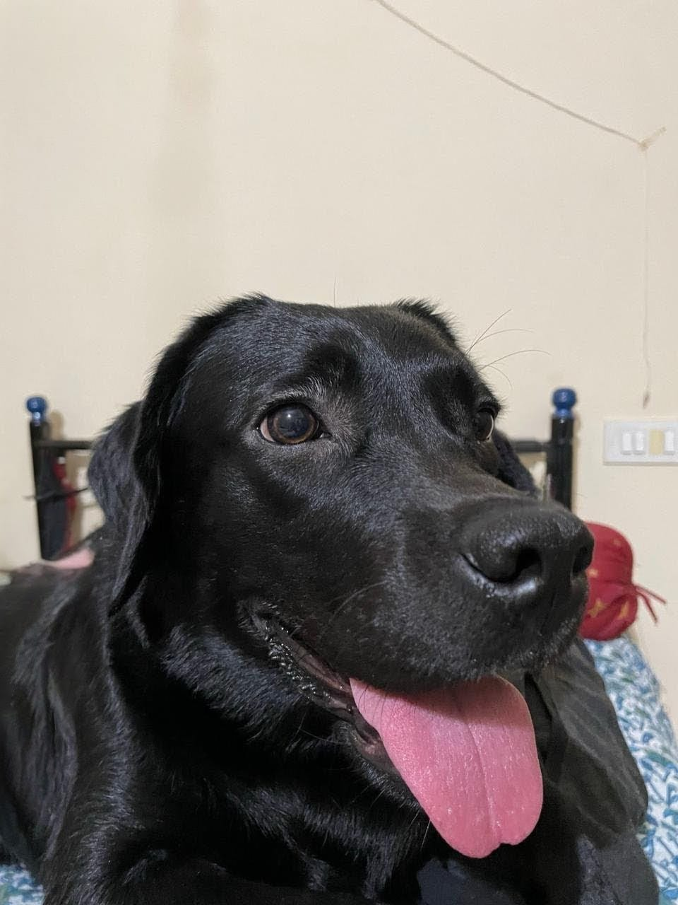

<!-- GIF -->

  

<!-- Hello -->
<h2 align="center">
  Hello! 
</h2>

---

## 🧑‍💻 About Me

Hi, I'm **Abhratanu** — a Data Analyst & BI Analyst who turns raw data into insights that drive smarter, faster decisions.  
I specialise in building dashboards, cleaning and modelling data, and designing workflows that actually make sense.

---

### 🚀 What I Do
- 📊 Build clear, decision-ready dashboards (Power BI & Tableau)  
- 📈 Analyse trends, patterns & KPIs for business impact  
- 🧹 Clean, transform & model large datasets (SQL, Python, Excel)  
- ⚙️ Automate reports & streamline data workflows  
- 🤝 Work closely with product, tech & ops to deliver actionable insights  

---

### 🛠️ Tools I Use

  
  
  
  
  
  
  
  
  
  
  
  
  

---

### 🌱 Currently Learning
- 🛠️ Building scalable data pipelines (SQL + Python)  
- 📈 Time-series forecasting & advanced analytics  
- 🧩 Data modelling & warehouse fundamentals (Star Schema)  
- 🎨 Better dashboard UX for storytelling impact  

---

### 🐾 Behind the Screens 
I’m a dog lover — and if you want to smile today,  
**check out April’s photo below… isn’t she adorable?** 🐶✨

  

